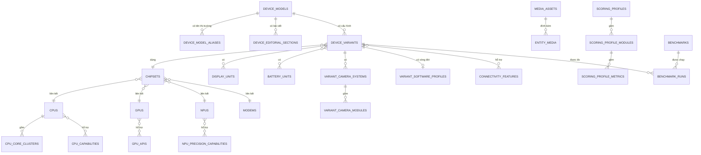

# SpecHub Catalog Platform v3

## Mục tiêu

Catalog Platform v3 tách dữ liệu dùng chung khỏi từng thiết bị, giữ thông số ở
dạng có cấu trúc và cho phép mở rộng sang laptop, tablet, wearable, TV hoặc thiết
bị gia dụng mà không phải tạo một schema riêng cho mỗi nhóm.

Các nguyên tắc bắt buộc:

- Một thực thể kỹ thuật dùng chung chỉ có một bản ghi gốc; model/variant liên kết
  tới bản ghi đó.
- Thông số dùng để lọc, so sánh hoặc tính điểm phải là cột hoặc quan hệ có cấu
  trúc, không nhúng trong đoạn văn.
- Bài viết dài, tóm tắt card và thông số kỹ thuật là ba lớp dữ liệu độc lập.
- File nhị phân nằm trong Storage. Database chỉ lưu provider, bucket, object key
  và metadata; URL phân phối được tạo khi đọc.
- Mọi lần publish profile điểm và mọi thay đổi thực thể quan trọng đều có phiên
  bản để truy vết.
- Wizard ghi vào draft trước. Publish mới tạo model/variant trong transaction.

## Ranh giới dữ liệu



### SoC và CPU

- `process_nodes` chuẩn hóa node, foundry và biến thể quy trình.
- `cpus` giữ kiến trúc, codename và process node.
- `cpu_core_clusters` biểu diễn từng cụm lõi với số lõi, min/max clock và thứ tự.
- `cpu_capabilities` cùng bảng nối biểu diễn ISA/feature như ARMv9, x86-64,
  RISC-V, AES, NEON, AVX, SVE, SMT, virtualization và AI acceleration.
- `gpus` liên kết `gpu_apis`; `npus` liên kết danh sách precision. Chuỗi legacy
  vẫn đọc được trong giai đoạn chuyển đổi nhưng luồng ghi mới dùng bảng nối.

### Camera, màn hình, pin và kết nối

- Camera tách `camera_sensors`, `camera_modules`, vai trò module, feature và video
  mode. Độ phân giải video là width/height/fps có cấu trúc.
- Display liên kết chuẩn HDR và color gamut; LTPO version, PWM frequency, peak
  brightness, touch sampling và protection là trường riêng.
- Battery liên kết các charging protocol thay vì ghi một chuỗi tổng hợp.
- Software profile tách OS ra mắt, OS hiện tại, OS tối đa, giao diện, kernel,
  security patch, chính sách cập nhật và trạng thái bootloader/root.
- Connectivity feature là danh mục tái sử dụng cho NFC, eSIM, UWB, satellite,
  GPS và các khả năng tương lai.

## Media và Storage

Luồng upload không chuyển file qua API:

1. Admin gửi tên file, MIME type và kích thước tới `POST /catalog-studio/media/uploads`.
2. API kiểm tra quyền, loại file, giới hạn 25 MB cho ảnh hoặc 2 GB cho video; tạo
   `media_assets` trạng thái `pending`.
3. API trả signed PUT URL có hiệu lực ngắn. Trình duyệt tải file thẳng lên bucket.
4. Admin gọi endpoint complete; asset chuyển sang `ready` và có thể gắn qua
   `entity_media`.
5. Khi đọc, API ghép `STORAGE_CDN_BASE_URL` với `object_key`. URL CDN không được
   ghi vào entity.

`media_assets.url` chỉ là trường tương thích ngược cho dữ liệu cũ. Luồng mới
không ghi trường này.

## Benchmark và hệ thống điểm

Mỗi `benchmark_run` phải chỉ rõ benchmark, version, nguồn/citation, thời điểm đo,
thiết bị, điều kiện test và kết quả. Điều này ngăn việc so sánh các số điểm không
cùng phiên bản hoặc không rõ điều kiện.

Benchmark hiệu năng nền tảng như AnTuTu và Geekbench CPU được nhập ở cấp
`chipset_benchmarks`, không lặp lại trên từng biến thể thiết bị. Với AnTuTu, mỗi
phiên bản benchmark là một definition riêng; `overall`, `cpu`, `gpu`, `memory`
và `ux` được lưu bằng `subscore_name`. Benchmark cấp thiết bị chỉ dành cho phép
đo thực sự phụ thuộc toàn bộ cấu hình máy và không được dùng làm điểm tổng.

Profile điểm có cấu trúc:

```text
profile(category, version, status)
  └─ module(weight)
       └─ metric(weight, normalization, direction, caps)
```

Điểm tổng:

```text
module_score = Σ(normalized_metric_score × metric_weight)
total_score  = Σ(module_score × module_weight)
```

Điểm thiết bị là scorecard tổng hợp toàn bộ hạng mục theo profile danh mục
(hiệu năng, màn hình, camera, pin, kết nối, hoàn thiện, phần mềm...). Điểm
benchmark chipset là đầu vào/tham chiếu cho hạng mục hiệu năng, không phải điểm
thiết bị.

Trọng số metric trong một module và trọng số module trong một profile phải có
tổng bằng 1 (sai số nhỏ do số thực). Publish tạo revision bất biến mới; scorecard
đã tính giữ `profile_version` để có thể tái hiện kết quả.

## Quy trình Admin

Khi tạo chipset/SoC, quản trị viên chọn các bản ghi CPU, GPU, NPU hiện có ngay
trong cùng một form. Mỗi lựa chọn được lưu bằng ID và tạo quan hệ dữ liệu thật
với chipset. Nếu catalog chưa có component phù hợp, quản trị viên có thể nhập
thông tin để tạo mới; CPU mới có thể khai báo các cụm nhân. API tạo chipset,
liên kết hoặc tạo ba component và lưu benchmark chipset trong một transaction;
lỗi ở bất kỳ bước nào sẽ không để lại bản ghi dở dang.

Biểu mẫu tạo riêng CPU, GPU, NPU và modem dùng cùng tên trường, đơn vị và cột
dữ liệu với các thành phần được chọn trong chipset. CPU tạo riêng cũng lưu các
cụm nhân vào `cpu_clusters`; vì vậy khi liên kết lại vào chipset, quản trị viên
chỉ chọn bản ghi hiện có thay vì nhập lại thông số.

Luồng nhập liệu chỉ hiển thị các thuộc tính có giá trị nhận diện hoặc so sánh
rõ ràng. Các trường trùng lặp như Big.LITTLE (suy ra từ cụm nhân), chuỗi API GPU
(suy ra từ OpenGL/OpenCL/Vulkan) và chuỗi định dạng NPU (suy ra từ INT8/FP16)
được hệ thống tổng hợp tự động. Những cột chuyên sâu cũ vẫn được giữ để tương
thích dữ liệu nhưng không còn làm nặng biểu mẫu tạo mới.

Wizard gồm chín bước:

1. Thông tin chung
2. Model
3. Chipset
4. Màn hình
5. Camera
6. Pin
7. Phần mềm
8. Media
9. Kiểm tra và publish

`catalog_drafts` lưu payload JSON, bước hiện tại và revision. Autosave dùng
optimistic concurrency: client phải gửi revision đã đọc; revision cũ bị từ chối
thay vì ghi đè dữ liệu mới. `catalog_draft_versions` hỗ trợ lịch sử và undo.
Validation chạy được trước publish. Smart search tìm theo tên model, codename,
SKU, tên thị trường và alias; chọn chipset có thể lấy trọn bundle CPU/GPU/NPU/
modem.

Publish tạo model, aliases, các section bài viết, variant và các bảng nối trong
transaction. Mọi chỉnh sửa model được chụp vào `catalog_entity_versions`.

## Nội dung công khai

- `device_models.summary`: nội dung ngắn cho card và hero.
- `device_editorial_sections`: các mục bài viết có thứ tự như tổng quan, thiết
  kế, hiệu năng, camera, pin, màn hình, phần mềm, điểm mạnh, hạn chế và đối tượng.
- Các bảng spec: nguồn duy nhất cho lọc và so sánh; bài viết không được dùng để
  thay thế dữ liệu spec.

## Tính tương thích và triển khai

Migration `20260728120000_catalog_platform_v3` là migration cộng thêm:

1. Deploy schema và API có khả năng đọc cả trường legacy lẫn bảng chuẩn hóa.
2. Chạy migration.
3. Seed các danh mục chuẩn và backfill dữ liệu legacy theo lô có idempotency.
4. Chuyển Admin sang chỉ ghi cấu trúc mới.
5. Theo dõi bản ghi chưa backfill, khóa ghi legacy, sau đó mới cân nhắc xóa cột
   legacy trong một release riêng.

Không xóa cột hoặc ép `NOT NULL` trong lần triển khai này. Các unique constraint,
foreign key và index theo khóa tìm kiếm được tạo cùng migration để chặn bản ghi
trùng và orphan.

## Mở rộng danh mục

Danh mục mới dùng chung model/variant/media/editorial/scoring. Phần đặc thù được
thêm dưới dạng module có bảng nối với variant và khai báo field metadata cho UI.
Không thêm JSON tùy ý vào `device_models`, không nhân bản CPU/GPU/display theo
từng category, và không nhúng URL file vào module. Cách này giữ được filter,
comparison, audit và scoring khi số loại thiết bị tăng.
