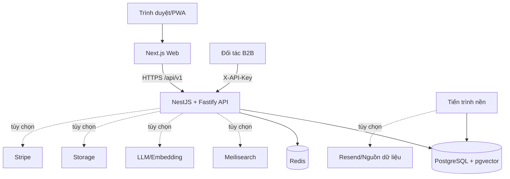
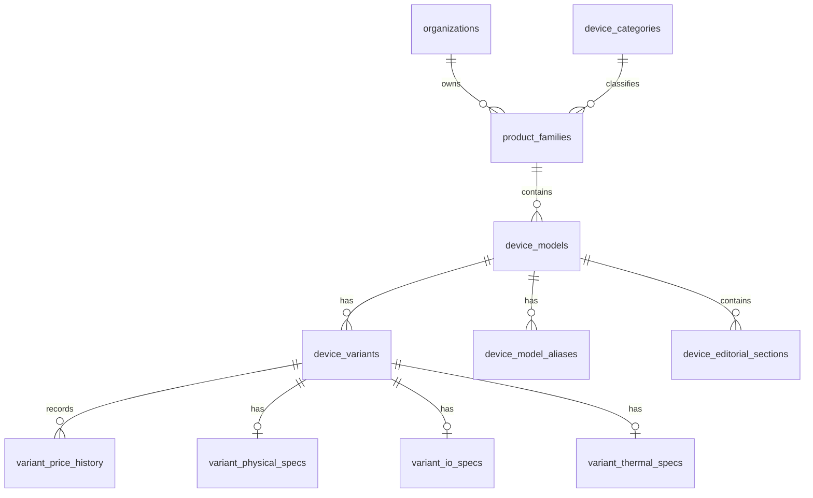
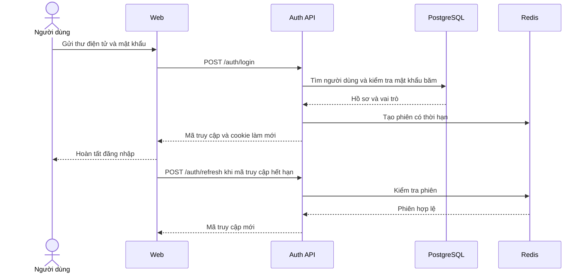
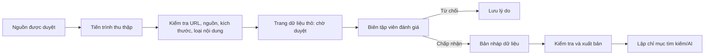

# ĐẶC TẢ KỸ THUẬT TỔNG THỂ NỀN TẢNG SPECHUB

## Thông tin tài liệu

| Thuộc tính | Giá trị |
| --- | --- |
| Tên hệ thống | Spechub |
| Loại tài liệu | Đặc tả yêu cầu, kiến trúc, dữ liệu và vận hành |
| Phiên bản tài liệu | 3.0 |
| Ngày rà soát | 05/08/2026 |
| Phạm vi rà soát | Toàn bộ mã nguồn trong monorepo `spechub` ở trạng thái hiện tại |
| Nguồn sự thật | Mã nguồn, `package.json`, cấu hình Turborepo, các bộ điều khiển NestJS, tuyến Next.js, lược đồ và migration Prisma, kiểm thử tự động |
| Trạng thái | Đã đối chiếu bằng phân tích tĩnh, biên dịch, kiểm tra kiểu, kiểm tra quy tắc mã và kiểm thử tự động |

## Lịch sử thay đổi

| Phiên bản | Ngày | Nội dung |
| --- | --- | --- |
| 3.0 | 05/08/2026 | Viết lại toàn bộ tài liệu theo trạng thái mã nguồn hiện hành; bổ sung Catalog Studio, hệ thống điểm, API B2B, Wiki, AI/RAG, thương mại, tác vụ nền và kết quả kiểm chứng |

## Mục lục

1. Giới thiệu
2. Phạm vi và thuật ngữ
3. Bên liên quan và tác nhân
4. Yêu cầu chức năng
5. Yêu cầu phi chức năng
6. Kiến trúc tổng thể
7. Tổ chức mã nguồn
8. Đặc tả ứng dụng web
9. Đặc tả API
10. Đặc tả dữ liệu
11. Các quy trình nghiệp vụ trọng yếu
12. Trí tuệ nhân tạo và truy xuất tăng cường
13. Bảo mật và kiểm soát truy cập
14. Tác vụ nền và tích hợp ngoài
15. Cấu hình và môi trường vận hành
16. Kiểm thử, chất lượng và tiêu chí nghiệm thu
17. Giới hạn hiện tại và định hướng phát triển
18. Hướng dẫn vận hành và xử lý sự cố
19. Phụ lục kiểm kê

---

## 1. Giới thiệu

### 1.1. Bối cảnh

Thông tin về thiết bị thông minh thường phân tán giữa trang của nhà sản xuất, nhà bán lẻ, cơ sở dữ liệu đánh giá chuẩn và các bài phân tích kỹ thuật. Cùng một thiết bị có thể có nhiều tên thương mại, biến thể bộ nhớ, khu vực phát hành và cấu hình phần cứng. Dữ liệu từ các nguồn khác nhau cũng có thể sử dụng đơn vị, thuật ngữ hoặc mức chi tiết không đồng nhất.

Spechub được xây dựng như một nền tảng tri thức thiết bị có cấu trúc. Hệ thống kết hợp danh mục thiết bị, linh kiện, nguồn tham chiếu, nội dung Wiki, công cụ so sánh, hệ thống điểm, trợ lý AI có căn cứ dữ liệu, chức năng theo dõi giá và API dành cho đối tác.

### 1.2. Mục tiêu tổng quát

Mục tiêu của hệ thống là cung cấp một nguồn dữ liệu thống nhất, có khả năng truy nguyên và có thể khai thác qua giao diện web hoặc API để hỗ trợ tra cứu, so sánh, nghiên cứu và ra quyết định về thiết bị thông minh.

### 1.3. Mục tiêu cụ thể

- Chuẩn hóa quan hệ giữa tổ chức, dòng sản phẩm, mẫu thiết bị, biến thể và thành phần phần cứng.
- Cung cấp tìm kiếm, lọc, xem chi tiết, so sánh và khuyến nghị theo nhu cầu.
- Quản lý nguồn, trích dẫn, nội dung biên tập và lịch sử phiên bản.
- Cung cấp trợ lý AI dựa trên dữ liệu danh mục và các nguồn đã được duyệt.
- Hỗ trợ danh sách yêu thích, lịch sử giá, cảnh báo giá và thông báo.
- Hỗ trợ tiếp thị liên kết, gói thuê bao, thanh toán và khóa API B2B.
- Cung cấp quy trình biên tập Catalog Studio có bản nháp, kiểm tra dữ liệu, lịch sử và xuất bản có kiểm soát.
- Bảo đảm khả năng kiểm thử, quan sát hệ thống và vận hành độc lập các tác vụ nền.

### 1.4. Phạm vi hiện thực

Phạm vi mã nguồn được rà soát gồm:

- 4 ứng dụng có thể triển khai: web, API, tiến trình nền và dịch vụ chẩn đoán AI.
- 11 gói dùng chung trong monorepo.
- 22 tuyến giao diện Next.js.
- 30 bộ điều khiển NestJS, trong đó 29 bộ điều khiển có hàm xử lý HTTP.
- 186 điểm cuối API: 91 GET, 57 POST, 24 PATCH, 13 DELETE và 1 PUT.
- 139 mô hình Prisma trong lược đồ PostgreSQL.
- 36 bộ kiểm thử với 189 ca kiểm thử trong ứng dụng API và 4 ca kiểm thử trong gói cơ sở dữ liệu.

### 1.5. Ngoài phạm vi hiện tại

- Cam kết hiệu năng ở quy mô lớn khi chưa có kết quả kiểm thử tải chuẩn hóa.
- Cam kết độ phủ toàn bộ thiết bị trên thị trường.
- Triển khai đa vùng, tự động chuyển vùng và diễn tập khôi phục thảm họa.
- Kết luận định lượng về độ chính xác của AI khi chưa có bộ dữ liệu đánh giá chuẩn.
- Thay thế tư vấn chuyên môn hoặc nguồn chính thức của nhà sản xuất.

---

## 2. Phạm vi và thuật ngữ

### 2.1. Ranh giới hệ thống

Spechub tiếp nhận dữ liệu từ nguồn được cấu hình, lưu dữ liệu thô vào vùng chờ duyệt, chuẩn hóa dữ liệu thành danh mục công khai, lập chỉ mục phục vụ tìm kiếm và AI, sau đó cung cấp dữ liệu qua web hoặc API. Hệ thống không cho phép tiến trình thu thập ghi trực tiếp vào danh mục công khai.

### 2.2. Thuật ngữ

| Thuật ngữ | Giải thích |
| --- | --- |
| Mẫu thiết bị | Sản phẩm ở cấp tên thương mại, thuộc một dòng sản phẩm và loại thiết bị |
| Biến thể | Cấu hình cụ thể của mẫu thiết bị theo bộ nhớ, lưu trữ, khu vực hoặc mã hàng |
| Mô-đun phần cứng | Thành phần tái sử dụng như chipset, CPU, GPU, màn hình, camera hoặc pin |
| Catalog Studio | Công cụ quản trị dữ liệu theo bản nháp, kiểm tra và xuất bản |
| Nguồn | Trang hoặc tài liệu gốc dùng để kiểm chứng thông tin |
| Trích dẫn | Liên kết giữa một nguồn và một thực thể/nội dung cụ thể |
| RAG | Cơ chế truy xuất dữ liệu liên quan trước khi sinh câu trả lời AI |
| Hồ sơ điểm | Bộ trọng số và quy tắc chuẩn hóa dùng để tính điểm theo loại thiết bị |
| Bảng điểm | Kết quả điểm của một biến thể theo một phiên bản hồ sơ điểm |
| Người dùng ẩn danh | Khách chưa đăng nhập; dữ liệu nghiên cứu cục bộ chỉ lưu trên thiết bị |
| Tiến trình nền | Ứng dụng độc lập thực thi tác vụ định kỳ hoặc tác vụ có thời gian xử lý dài |

### 2.3. Nguyên tắc dữ liệu

1. Dữ liệu dùng để lọc, so sánh hoặc tính điểm phải được lưu ở trường hoặc quan hệ có cấu trúc.
2. Không sử dụng nội dung tiếp thị làm nguồn duy nhất cho thông số kỹ thuật.
3. Trường chưa xác minh để trống; không điền số 0 hoặc giá trị ước đoán.
4. Bài viết dài, tóm tắt thẻ và thông số kỹ thuật là ba lớp dữ liệu độc lập.
5. Dữ liệu công khai phải đi qua quy trình kiểm tra hoặc xuất bản phù hợp.
6. Tệp nhị phân nằm trong kho lưu trữ; cơ sở dữ liệu chỉ lưu khóa đối tượng và siêu dữ liệu.
7. Kết quả điểm phải gắn với phiên bản hồ sơ để có thể tái lập.

---

## 3. Bên liên quan và tác nhân

| Tác nhân | Mục tiêu | Quyền chính |
| --- | --- | --- |
| Khách truy cập | Tra cứu, đọc, so sánh và nhận khuyến nghị | Truy cập dữ liệu công khai; lưu vùng nghiên cứu trên trình duyệt |
| Người dùng | Cá nhân hóa và theo dõi thiết bị | Hồ sơ, danh sách yêu thích, cảnh báo giá, thông báo, gói thuê bao, khóa API nếu đủ quyền lợi |
| Biên tập viên | Cập nhật danh mục và nội dung | Tạo/sửa dữ liệu, bản nháp, nguồn và trích dẫn trong phạm vi được cấp |
| Kiểm duyệt viên | Kiểm tra nội dung cộng đồng | Duyệt phiên bản Wiki và một số thay đổi được ủy quyền |
| Quản trị viên | Quản trị toàn hệ thống | Người dùng, vai trò, catalog, hồ sơ điểm, gói dịch vụ, nhật ký, tích hợp và vận hành |
| Đối tác B2B | Khai thác dữ liệu qua API | Truy cập theo khóa, phạm vi quyền, giới hạn tần suất và hạn mức |
| Tiến trình nền | Thực hiện công việc định kỳ | Kiểm tra cảnh báo, thu thập nguồn và gửi thư thông báo |
| Nhà cung cấp ngoài | Cung cấp khả năng chuyên biệt | Mô hình AI, thanh toán, thư điện tử, tìm kiếm, kho lưu trữ hoặc dữ liệu giá |

---

## 4. Yêu cầu chức năng

### 4.1. Nhóm tài khoản và phiên đăng nhập

| Mã | Yêu cầu | Tiêu chí chấp nhận |
| --- | --- | --- |
| FR-AUTH-01 | Đăng ký tài khoản bằng thư điện tử và mật khẩu | Dữ liệu được kiểm tra; mật khẩu được băm; tài khoản được tạo duy nhất |
| FR-AUTH-02 | Đăng nhập | Trả mã truy cập ngắn hạn và tạo phiên làm mới có thể thu hồi |
| FR-AUTH-03 | Làm mới phiên | Chỉ làm mới khi phiên còn hiệu lực trong Redis |
| FR-AUTH-04 | Đăng xuất | Thu hồi phiên hiện hành ở phía máy chủ |
| FR-AUTH-05 | Xem và cập nhật hồ sơ | Chỉ chủ tài khoản được cập nhật hồ sơ của mình |
| FR-AUTH-06 | Đổi mật khẩu | Kiểm tra mật khẩu hiện tại và thu hồi phiên nếu chính sách yêu cầu |
| FR-AUTH-07 | Quản trị người dùng | Quản trị viên có thể xem danh sách, đổi vai trò, khóa hoặc xóa theo quy tắc nghiệp vụ |

### 4.2. Nhóm danh mục thiết bị

| Mã | Yêu cầu | Tiêu chí chấp nhận |
| --- | --- | --- |
| FR-CAT-01 | Quản lý loại thiết bị | Có cấu trúc cây, slug duy nhất và thao tác quản trị được phân quyền |
| FR-CAT-02 | Quản lý tổ chức/nhãn hiệu | Có tên, slug, mô tả và thông tin đã xác minh |
| FR-CAT-03 | Quản lý dòng sản phẩm | Thuộc đúng tổ chức và loại thiết bị |
| FR-CAT-04 | Quản lý mẫu thiết bị | Có tóm tắt, nội dung biên tập, trạng thái phát hành, alias và media |
| FR-CAT-05 | Quản lý biến thể | Liên kết đúng mẫu thiết bị, mã hàng, giá và cấu hình phần cứng |
| FR-CAT-06 | Xem chi tiết mẫu thiết bị | Hiển thị biến thể, mô-đun, điểm, benchmark, media, nguồn và dữ liệu thương mại khả dụng |
| FR-CAT-07 | Tra cứu phần cứng | Cho phép liệt kê và xem chi tiết chipset, CPU, GPU, NPU, modem, màn hình, camera, pin, bộ nhớ, lưu trữ và phần mềm |
| FR-CAT-08 | Quản lý quan hệ phần cứng | Một thành phần dùng chung chỉ có một bản ghi gốc và được liên kết qua bảng nối |
| FR-CAT-09 | Quản lý media | Tải trực tiếp tới kho lưu trữ bằng URL ký ngắn hạn; cơ sở dữ liệu lưu trạng thái và siêu dữ liệu |

### 4.3. Nhóm tìm kiếm, so sánh và vùng nghiên cứu

| Mã | Yêu cầu | Tiêu chí chấp nhận |
| --- | --- | --- |
| FR-EXP-01 | Tìm kiếm toàn văn | Tìm theo tên, slug, alias và dữ liệu liên quan; hỗ trợ công cụ tìm kiếm tùy chọn |
| FR-EXP-02 | Lọc và phân trang | Bộ lọc được phản ánh trên URL và kết quả có phân trang ổn định |
| FR-EXP-03 | So sánh thiết bị | Hiển thị nhiều thiết bị trên cùng hệ thuộc tính và phân biệt dữ liệu thiếu với giá trị bằng không |
| FR-EXP-04 | Vùng nghiên cứu ẩn danh | Lưu khay so sánh, thiết bị gần đây và truy vấn gần đây trên thiết bị của khách |
| FR-EXP-05 | Chia sẻ so sánh | Tạo URL có thể tái lập danh sách thiết bị được chọn |
| FR-EXP-06 | Khuyến nghị theo nhu cầu | Chuyển nhu cầu, ngân sách và ưu tiên thành danh sách gợi ý có giải thích |

### 4.4. Nhóm AI và tri thức

| Mã | Yêu cầu | Tiêu chí chấp nhận |
| --- | --- | --- |
| FR-AI-01 | Hỏi đáp theo danh mục | Câu trả lời chỉ sử dụng ngữ cảnh được truy xuất và công bố giới hạn |
| FR-AI-02 | Trả lời theo luồng | Gửi sự kiện trạng thái, ngữ cảnh, nội dung và kết quả cuối qua NDJSON |
| FR-AI-03 | Trích dẫn | Mọi khẳng định định lượng quan trọng phải có trích dẫn hợp lệ hoặc bị loại khỏi kết quả |
| FR-AI-04 | Tìm kiếm ngữ nghĩa | Lập chỉ mục véc-tơ cho phạm vi dữ liệu được duyệt |
| FR-AI-05 | Nghiên cứu phần cứng | Tổng hợp dữ liệu của một mô-đun phần cứng và các thiết bị liên quan |
| FR-AI-06 | Xây dựng lại kho tri thức | Quản trị viên/biên tập viên có thể lập chỉ mục lại phạm vi đã phê duyệt |
| FR-AI-07 | Phương án cục bộ | Hệ thống có thể hoạt động với bộ sinh câu trả lời và embedding cục bộ khi không cấu hình nhà cung cấp ngoài |

### 4.5. Nhóm Wiki, nguồn và kiểm duyệt

| Mã | Yêu cầu | Tiêu chí chấp nhận |
| --- | --- | --- |
| FR-WIKI-01 | Đọc bài Wiki công khai | Chỉ bài đã xuất bản được hiển thị cho khách |
| FR-WIKI-02 | Tạo và sửa bài | Thay đổi tạo phiên bản mới, không ghi đè lịch sử |
| FR-WIKI-03 | Duyệt phiên bản | Người có quyền có thể xuất bản hoặc từ chối với lý do |
| FR-WIKI-04 | Quản lý trích dẫn | Nguồn và trích dẫn được lưu độc lập, có thể liên kết với nội dung |
| FR-WIKI-05 | Quản lý bình luận | Bình luận gắn với bài/người dùng và tuân theo trạng thái kiểm duyệt |
| FR-WIKI-06 | Thu thập dữ liệu | Nguồn được cấu hình; trang thô luôn vào trạng thái chờ duyệt |
| FR-WIKI-07 | Hàng đợi kiểm duyệt | Biên tập viên xem, đánh giá và chuyển trạng thái trang thô trước khi sử dụng |

### 4.6. Nhóm Catalog Studio và hệ thống điểm

| Mã | Yêu cầu | Tiêu chí chấp nhận |
| --- | --- | --- |
| FR-STUDIO-01 | Tạo bản nháp | Bản nháp lưu dữ liệu từng bước và số phiên bản |
| FR-STUDIO-02 | Lưu tự động có kiểm soát xung đột | Yêu cầu cập nhật phải gửi đúng revision; bản cũ bị từ chối |
| FR-STUDIO-03 | Khôi phục lịch sử | Có thể xem và khôi phục phiên bản bản nháp trước đó |
| FR-STUDIO-04 | Kiểm tra trước xuất bản | Trả danh sách lỗi trường, quan hệ, nguồn và độ phủ bắt buộc |
| FR-STUDIO-05 | Xuất bản giao dịch | Tạo/cập nhật các thực thể liên quan trong một giao dịch dữ liệu |
| FR-STUDIO-06 | Quản lý hồ sơ điểm | Hồ sơ gồm mô-đun, trọng số, chỉ số, hướng tốt/xấu và quy tắc chuẩn hóa |
| FR-STUDIO-07 | Xuất bản hồ sơ điểm | Phiên bản đã xuất bản là bất biến; trọng số phải hợp lệ |
| FR-STUDIO-08 | Tính bảng điểm | Kết quả lưu phiên bản hồ sơ, điểm mô-đun, điểm tổng và đầu vào đo được |

### 4.7. Nhóm cá nhân hóa và thương mại

| Mã | Yêu cầu | Tiêu chí chấp nhận |
| --- | --- | --- |
| FR-ENG-01 | Danh sách yêu thích | Người dùng tạo nhiều danh sách và quản lý thiết bị trong từng danh sách |
| FR-ENG-02 | Đồng bộ vùng nghiên cứu | Người dùng đăng nhập có thể nhập dữ liệu cục bộ theo quy tắc không tạo bản ghi trùng |
| FR-ENG-03 | Cảnh báo giá | Theo dõi biến thể, ngưỡng, tiền tệ và trạng thái kích hoạt |
| FR-ENG-04 | Thông báo trong ứng dụng | Hiển thị danh sách, số chưa đọc, đánh dấu một hoặc toàn bộ là đã đọc |
| FR-ENG-05 | Gửi thư thông báo | Ghi hàng đợi bền vững; tiến trình nền thử lại có kiểm soát |
| FR-COM-01 | Quản lý đối tác liên kết | Lưu đối tác, thị trường, trạng thái và cấu hình cần thiết |
| FR-COM-02 | Quản lý liên kết mua hàng | Kiểm tra liên kết, giá, tiền tệ, tồn kho và thời điểm đồng bộ |
| FR-COM-03 | Theo dõi lượt nhấp | Ghi nhận sự kiện phục vụ thống kê mà không làm gián đoạn điều hướng |
| FR-COM-04 | Lịch sử giá | Lưu thay đổi giá theo thời gian để đánh giá cảnh báo và xu hướng |
| FR-BILL-01 | Gói thuê bao | Hiển thị gói công khai và cho quản trị viên quản lý gói |
| FR-BILL-02 | Thanh toán | Tạo phiên thanh toán khi Stripe được cấu hình |
| FR-BILL-03 | Webhook | Xác minh chữ ký, chống xử lý lặp và ghi nhật ký bền vững |
| FR-BILL-04 | Quản lý thuê bao | Người dùng xem, hủy, tiếp tục hoặc thử lại thanh toán theo trạng thái |

### 4.8. Nhóm API B2B và vận hành

| Mã | Yêu cầu | Tiêu chí chấp nhận |
| --- | --- | --- |
| FR-B2B-01 | Tạo khóa API | Chỉ trả bí mật một lần; cơ sở dữ liệu chỉ lưu mã băm |
| FR-B2B-02 | Luân chuyển và thu hồi | Khóa cũ mất hiệu lực khi bị thu hồi/luân chuyển |
| FR-B2B-03 | Phạm vi và hạn mức | Kiểm tra scope, giới hạn mỗi phút và hạn mức tháng |
| FR-B2B-04 | Thống kê sử dụng | Ghi nhận số lần gọi và kết quả theo khóa |
| FR-OPS-01 | Kiểm tra trạng thái tiến trình | Điểm cuối `health/live` phản ánh tiến trình API |
| FR-OPS-02 | Kiểm tra mức sẵn sàng | Điểm cuối `health/ready` kiểm tra PostgreSQL và Redis |
| FR-OPS-03 | Chỉ số giám sát | Chỉ cung cấp khi có mã truy cập giám sát hợp lệ |
| FR-OPS-04 | Mã định danh yêu cầu | Mỗi phản hồi có `X-Request-ID` để đối chiếu nhật ký |
| FR-OPS-05 | Bảng điều khiển quản trị | Tổng hợp số liệu vận hành và dữ liệu quản trị theo quyền |

---

## 5. Yêu cầu phi chức năng

### 5.1. An toàn thông tin

- NFR-SEC-01: API từ chối thuộc tính DTO không được khai báo.
- NFR-SEC-02: Các điểm cuối được bảo vệ mặc định bằng JWT; truy cập công khai phải được khai báo rõ.
- NFR-SEC-03: Quyền đặc thù được kiểm tra bằng vai trò và kiểm tra nghiệp vụ ở lớp dịch vụ.
- NFR-SEC-04: Mật khẩu được băm; khóa API chỉ lưu mã băm; bí mật không được ghi vào mã nguồn hoặc báo cáo.
- NFR-SEC-05: CORS chỉ chấp nhận các nguồn giao diện đã cấu hình; Helmet được bật.
- NFR-SEC-06: Webhook thanh toán phải xác minh chữ ký và cửa sổ thời gian.
- NFR-SEC-07: Bộ thu thập phải chặn địa chỉ nội bộ, chuyển hướng khác nguồn, URL có thông tin đăng nhập, nội dung quá lớn và loại nội dung không cho phép.

### 5.2. Tính đúng và toàn vẹn dữ liệu

- NFR-DATA-01: Sử dụng khóa chính, khóa ngoại, chỉ mục và ràng buộc duy nhất phù hợp.
- NFR-DATA-02: Migration chỉ được áp dụng sau khi rà soát; không đặt lại cơ sở dữ liệu có dữ liệu cần giữ.
- NFR-DATA-03: Bản nháp sử dụng revision để phát hiện ghi đè đồng thời.
- NFR-DATA-04: Webhook, gửi thư và tác vụ nền phải có tính lũy đẳng hoặc cơ chế chống xử lý lặp.
- NFR-DATA-05: Trạng thái công khai, bản nháp và dữ liệu thô phải tách biệt.

### 5.3. Hiệu năng và khả năng mở rộng

- NFR-PERF-01: Danh sách lớn phải phân trang và sử dụng chỉ mục theo trường tìm kiếm/lọc.
- NFR-PERF-02: Truy vấn so sánh phải tải dữ liệu theo lô, tránh truy vấn lặp theo từng phần tử.
- NFR-PERF-03: Tác vụ dài hoặc định kỳ chạy ngoài luồng yêu cầu người dùng.
- NFR-PERF-04: Có thể sử dụng Redis cho phiên và bộ nhớ đệm; Meilisearch là lựa chọn bổ sung cho tìm kiếm.
- NFR-PERF-05: Chưa công bố ngưỡng độ trễ cho đến khi có kiểm thử tải tái lập.

### 5.4. Khả dụng và khả năng phục hồi

- NFR-AVL-01: Tách trạng thái tiến trình và mức sẵn sàng phụ thuộc.
- NFR-AVL-02: Khi nhà cung cấp AI không sẵn sàng, hệ thống phải dùng phương án cục bộ hoặc trả lỗi có kiểm soát.
- NFR-AVL-03: Khi gửi thư ngoài ứng dụng bị tắt, thông báo trong ứng dụng vẫn được lưu.
- NFR-AVL-04: Tiến trình nền không được chạy chồng cùng một công việc trong cùng tiến trình.
- NFR-AVL-05: Quy trình triển khai phải có sao lưu, khôi phục và phương án quay lui.

### 5.5. Khả năng bảo trì

- NFR-MNT-01: Mã nguồn tổ chức theo ứng dụng triển khai và gói dùng chung.
- NFR-MNT-02: API phân mô-đun theo miền nghiệp vụ.
- NFR-MNT-03: Tên tệp TypeScript sử dụng `kebab-case`; kiểu/lớp sử dụng `PascalCase`; biến/hàm sử dụng `camelCase`.
- NFR-MNT-04: Thay đổi phải vượt qua kiểm tra quy tắc mã, kiểu dữ liệu, kiểm thử và biên dịch.
- NFR-MNT-05: Đặc tả và báo cáo phải cập nhật khi số tuyến, điểm cuối hoặc mô hình dữ liệu thay đổi đáng kể.

### 5.6. Trải nghiệm và khả năng tiếp cận

- NFR-UX-01: Giao diện phải hoạt động trên màn hình máy tính và thiết bị di động.
- NFR-UX-02: Trạng thái tải, rỗng, lỗi và ngoại tuyến phải được phân biệt.
- NFR-UX-03: Điều khiển phải có nhãn; hình có mô tả thay thế; tương phản đủ để đọc.
- NFR-UX-04: Dữ liệu thiếu không được hiển thị như giá trị bằng không.
- NFR-UX-05: Kết quả AI và điểm số phải có giải thích, nguồn hoặc thông tin phương pháp.

---

## 6. Kiến trúc tổng thể

### 6.1. Kiểu kiến trúc

Spechub sử dụng monorepo và kiến trúc nguyên khối mô-đun cho API, kết hợp các tiến trình triển khai độc lập. API tập trung quy tắc nghiệp vụ; web tập trung trình bày; tiến trình nền đảm nhiệm công việc định kỳ; các gói dùng chung cung cấp kiểu dữ liệu, truy cập dữ liệu, thuật toán AI và chấm điểm.



### 6.2. Luồng yêu cầu HTTP

1. Fastify tiếp nhận yêu cầu và gắn mã định danh.
2. Helmet, CORS và bộ phân tích nội dung áp dụng cấu hình nền.
3. Throttler kiểm tra tần suất.
4. JWT guard bảo vệ mặc định, trừ điểm cuối khai báo công khai.
5. Roles guard kiểm tra vai trò nếu điểm cuối yêu cầu.
6. ValidationPipe chuyển đổi và kiểm tra DTO, từ chối thuộc tính lạ.
7. Bộ điều khiển chuyển yêu cầu tới lớp dịch vụ.
8. Lớp dịch vụ kiểm tra quyền sở hữu/trạng thái và truy cập Prisma, Redis hoặc dịch vụ ngoài.
9. Bộ lọc lỗi toàn cục chuẩn hóa phản hồi và giữ mã định danh yêu cầu.

### 6.3. Phụ thuộc triển khai

| Thành phần | Bắt buộc | Vai trò |
| --- | --- | --- |
| PostgreSQL | Có | Dữ liệu quan hệ, chỉ mục mở rộng và véc-tơ |
| Redis | Có đối với luồng đã xác thực | Phiên có thể thu hồi và dữ liệu tạm |
| Meilisearch | Không | Tăng cường tìm kiếm danh mục |
| Ollama/OpenAI/Anthropic | Không | Sinh câu trả lời AI theo cấu hình |
| Kho lưu trữ S3 tương thích | Không trong phát triển | Media Catalog Studio; có phương án lưu cục bộ |
| Stripe | Không | Thanh toán thuê bao |
| Resend | Không | Gửi thư thông báo |
| Dịch vụ giá thương mại | Không | Cầu nối tới API giá chính thức |

---

## 7. Tổ chức mã nguồn

### 7.1. Cấu trúc cấp cao

```text
spechub/
├── apps/
│   ├── api/          API NestJS/Fastify
│   ├── web/          Ứng dụng Next.js
│   ├── worker/       Cảnh báo giá, thu thập nguồn, gửi thư
│   └── ai-service/   Chẩn đoán embedding cục bộ
├── packages/
│   ├── database/     Prisma, migration, seed, kiểm chứng dữ liệu
│   ├── api-client/   Trình khách API có kiểu
│   ├── ai-core/      Embedding cục bộ và hỗ trợ véc-tơ
│   ├── alerts-core/  Quy tắc kiểm tra cảnh báo giá
│   ├── scoring-core/ Thuật toán chuẩn hóa và tính điểm
│   ├── auth/         Tiện ích xác thực dùng chung
│   ├── analytics/    Giao diện phân tích
│   ├── config/       Cấu hình TypeScript, ESLint, Tailwind
│   ├── types/        Kiểu dữ liệu dùng chung
│   ├── ui/           Thành phần giao diện dùng chung
│   └── utils/        Tiện ích chung
├── docs/             Quy chuẩn nội dung và Catalog Platform v3
├── scripts/          Công cụ vận hành dự án
├── turbo.json        Đồ thị tác vụ monorepo
├── pnpm-workspace.yaml
└── package.json
```

### 7.2. Số liệu mã nguồn

| Khu vực | Số tệp TS/TSX/Python/Prisma | Số dòng gần đúng |
| --- | ---: | ---: |
| `apps/api` | 241 | 38.294 |
| `apps/web` | 77 | 37.351 |
| `apps/worker` | 3 | 827 |
| `apps/ai-service` | 1 | 72 |
| `packages/database` | 27 | 32.096 |
| `packages/scoring-core` | 3 | 842 |
| Các gói dùng chung còn lại | 8 | 516 |
| Tổng cộng | 360 | 113.998 |

Số liệu không bao gồm `node_modules`, thư mục biên dịch, bộ nhớ đệm Next.js, mã sinh tự động và báo cáo độ phủ.

### 7.3. Chuỗi công cụ

| Công nghệ | Phiên bản khai báo |
| --- | --- |
| Node.js | `>=22.11.0` |
| pnpm | `9.15.0` |
| Turborepo | `2.3.3` |
| TypeScript | `5.7.2` |
| Next.js | `15.1.3` |
| React | `19.x` |
| NestJS | `11.0.6` |
| Fastify | `5.2.0` |
| Prisma | `6.1.0` |
| Meilisearch SDK | `0.46.0` |
| TanStack Query | `5.62.10` |

---

## 8. Đặc tả ứng dụng web

### 8.1. Nguyên tắc

- Sử dụng Next.js App Router.
- Thành phần máy chủ tải dữ liệu ban đầu khi phù hợp; thành phần máy khách xử lý tương tác.
- `QueryProvider` quản lý dữ liệu bất đồng bộ phía máy khách.
- `AuthProvider` quản lý trạng thái đăng nhập và làm mới phiên.
- `AppShell` cung cấp điều hướng chung, vùng lệnh và thành phần PWA.
- URL API công khai lấy từ `NEXT_PUBLIC_SPECHUB_API_URL`; tải phía máy chủ ưu tiên `SPECHUB_API_INTERNAL_URL`.
- Trang lỗi, tải, không tìm thấy và ngoại tuyến được khai báo độc lập.

### 8.2. Danh mục tuyến

| Tuyến | Mục đích | Kiểu |
| --- | --- | --- |
| `/` | Trang chủ, tìm kiếm nhanh và thiết bị nổi bật | Động |
| `/devices` | Danh mục thiết bị, lọc và phân trang | Động |
| `/devices/[slug]` | Chi tiết mẫu, biến thể, media, mô-đun và điểm | Động |
| `/hardware/[kind]/[slug]` | Chi tiết thành phần phần cứng | Động |
| `/search` | Tìm kiếm thiết bị và phần cứng | Động |
| `/compare` | So sánh thiết bị | Động |
| `/recommend` | Khuyến nghị theo nhu cầu | Động |
| `/ai` | Trợ lý AI theo luồng | Động |
| `/wiki` | Danh sách bài Wiki | Tĩnh có dữ liệu phía máy khách |
| `/wiki/[slug]` | Đọc bài Wiki | Động |
| `/wiki/new` | Tạo bài Wiki | Có kiểm soát quyền |
| `/wiki/[slug]/edit` | Tạo phiên bản sửa | Có kiểm soát quyền |
| `/login` | Đăng nhập | Tĩnh |
| `/register` | Đăng ký | Tĩnh |
| `/dashboard` | Tổng quan cá nhân | Tĩnh có dữ liệu phía máy khách |
| `/wishlist` | Danh sách yêu thích | Tĩnh có xác thực |
| `/alerts` | Cảnh báo giá | Tĩnh có xác thực |
| `/notifications` | Trung tâm thông báo | Tĩnh có xác thực |
| `/billing` | Gói và thuê bao | Tĩnh có xác thực |
| `/api-access` | Khóa API và mức sử dụng | Tĩnh có xác thực |
| `/admin` | Catalog Studio và quản trị | Tĩnh có phân quyền |
| `/offline` | Trang dự phòng PWA | Tĩnh |

### 8.3. Thành phần giao diện trọng yếu

- `admin-console`: bề mặt quản trị người dùng, danh mục, đối tác, gói và nhật ký.
- `catalog-studio-wizard`: quy trình tạo dữ liệu danh mục theo nhiều bước.
- `scoring-profile-manager`: cấu hình, kiểm tra và xuất bản hồ sơ điểm.
- `device-spec-modules`: trình bày thông số có cấu trúc theo nhóm.
- `device-scorecard` và `catalog-score`: hiển thị điểm, mô-đun và giải thích.
- `device-media-gallery`: ảnh/video của thiết bị theo dữ liệu media.
- `marketplace-offers`: đề nghị mua hàng và giá từ đối tác.
- `device-recommender`: thu thập nhu cầu và hiển thị gợi ý.
- `ai-stream-answer`: xử lý sự kiện NDJSON của câu trả lời AI.
- `research-workspace`: vùng nghiên cứu cục bộ cho khách và người dùng.
- `wiki-editor` và `wiki-article-reader`: soạn thảo, hiển thị Markdown và trích dẫn.

### 8.4. PWA và trạng thái ngoại tuyến

Ứng dụng cung cấp manifest, thành phần cài đặt và trang `/offline`. Dữ liệu cục bộ của khách chỉ nhằm hỗ trợ tiếp tục nghiên cứu; giá, thông báo và dữ liệu đã xuất bản phải được tải lại khi có kết nối để tránh sử dụng trạng thái cũ như dữ liệu hiện hành.

---

## 9. Đặc tả API

### 9.1. Quy ước chung

- Tiền tố toàn cục: `/api`.
- Phiên bản mặc định: `/v1`.
- Cơ sở phát triển: `http://localhost:4000/api/v1`.
- Swagger trong môi trường không phải vận hành: `/api/docs`.
- Dữ liệu đầu vào được kiểm tra với `whitelist`, `forbidNonWhitelisted` và chuyển đổi kiểu.
- Phản hồi lỗi được chuẩn hóa bởi bộ lọc lỗi toàn cục.
- Xác thực mặc định bằng Bearer JWT; API B2B dùng `X-API-Key`.
- Mỗi phản hồi có `X-Request-ID`.

### 9.2. Thống kê bề mặt API

| Phương thức | Số lượng |
| --- | ---: |
| GET | 91 |
| POST | 57 |
| PATCH | 24 |
| DELETE | 13 |
| PUT | 1 |
| Tổng | 186 |

Kết quả phân tích decorator ghi nhận 45 lần khai báo quyền `ADMIN`, 33 lần `EDITOR` và 3 lần `MODERATOR`. Con số này phản ánh decorator được phát hiện trong mã nguồn, không thay thế kiểm tra quyền sở hữu và logic ở lớp dịch vụ.

### 9.3. Nhóm bộ điều khiển

| Tiền tố | Số điểm cuối | Trách nhiệm |
| --- | ---: | --- |
| `health` | 4 | Trạng thái tổng, tiến trình, mức sẵn sàng và chỉ số |
| `admin/dashboard` | 1 | Tổng quan quản trị |
| `affiliate` | 13 | Đối tác, liên kết, đồng bộ giá, thống kê và lượt nhấp |
| `ai` | 10 | Hỏi đáp, trả lời theo luồng, khuyến nghị, tìm kiếm, nghiên cứu và lập chỉ mục |
| `alerts` | 5 | Cảnh báo giá và kiểm tra thủ công |
| `api-keys` | 4 | Danh sách, tạo, luân chuyển và thu hồi khóa |
| `auth` | 5 | Đăng ký, đăng nhập, làm mới, thông tin phiên và đăng xuất |
| `b2b` | 3 | Đọc mẫu/biến thể qua khóa API |
| `battery-units` | 3 | Danh sách và chi tiết pin |
| `camera-modules` | 3 | Danh sách và chi tiết mô-đun camera |
| `admin/catalog-studio` | 17 | Tìm kiếm, bản nháp, lịch sử, kiểm tra, xuất bản, hồ sơ điểm và media |
| `chipsets` | 3 | Danh sách và chi tiết chipset |
| `citations` | 7 | Nguồn và trích dẫn |
| `data-ingestion` | 8 | Nguồn thu thập, trang thô và hàng đợi duyệt |
| `device-categories` | 7 | Loại thiết bị và cấu trúc cây |
| `device-models` | 7 | Mẫu thiết bị và trạng thái phát hành |
| `device-variants` | 10 | Biến thể, benchmark, hồ sơ điểm và so sánh |
| `display-units` | 3 | Danh sách và chi tiết màn hình |
| `admin/hardware` | 5 | Tạo, sửa và xóa mô-đun phần cứng |
| `hardware` | 11 | Đọc các loại phần cứng và phần mềm |
| `notifications` | 5 | Danh sách, số chưa đọc, tạo và đánh dấu đã đọc |
| `organizations` | 6 | Tổ chức/nhãn hiệu |
| `product-families` | 6 | Dòng sản phẩm |
| `search` | 1 | Tìm kiếm tổng hợp |
| `subscriptions` | 12 | Gói, thuê bao, thanh toán và nhật ký |
| `subscriptions/webhooks` | 1 | Webhook nhà cung cấp thanh toán |
| `users` | 9 | Hồ sơ và quản trị người dùng |
| `wiki` | 9 | Bài viết, phiên bản và xuất bản |
| `wishlists` | 8 | Danh sách, mục và đồng bộ vùng nghiên cứu |

### 9.4. Điểm cuối trọng yếu theo hành trình

#### Xác thực

```text
POST /api/v1/auth/register
POST /api/v1/auth/login
POST /api/v1/auth/refresh
GET  /api/v1/auth/me
POST /api/v1/auth/logout
```

#### Khám phá danh mục

```text
GET /api/v1/device-models
GET /api/v1/device-models/:slug
GET /api/v1/device-variants
GET /api/v1/device-variants/compare
GET /api/v1/hardware/:kind/:slug
GET /api/v1/search
```

#### AI

```text
POST /api/v1/ai/ask
POST /api/v1/ai/ask/stream
POST /api/v1/ai/chat
POST /api/v1/ai/recommendations
GET  /api/v1/ai/search
POST /api/v1/ai/research/hardware/:kind/:slug
```

#### Catalog Studio

```text
GET   /api/v1/admin/catalog-studio/search
POST  /api/v1/admin/catalog-studio/drafts
PATCH /api/v1/admin/catalog-studio/drafts/:id
POST  /api/v1/admin/catalog-studio/drafts/:id/validate
POST  /api/v1/admin/catalog-studio/drafts/:id/complete
GET   /api/v1/admin/catalog-studio/history/:entityTable/:entityId
POST  /api/v1/admin/catalog-studio/scoring-profiles/:id/publish
POST  /api/v1/admin/catalog-studio/media/uploads
PUT   /api/v1/admin/catalog-studio/media/uploads/:id/content
POST  /api/v1/admin/catalog-studio/media/uploads/:id/complete
```

#### Cá nhân hóa và thương mại

```text
GET/POST/PATCH/DELETE /api/v1/wishlists/...
GET/POST/PATCH/DELETE /api/v1/alerts/...
GET/PATCH             /api/v1/notifications/...
GET/POST/PATCH        /api/v1/subscriptions/...
GET/POST/PATCH/DELETE /api/v1/affiliate/...
GET/POST/DELETE       /api/v1/api-keys/...
```

### 9.5. Mã trạng thái và lỗi

- `200`: đọc hoặc thao tác thành công.
- `201`: tạo tài nguyên thành công.
- `204`: thao tác thành công không có nội dung trả về, nếu được áp dụng.
- `400`: dữ liệu đầu vào hoặc trạng thái nghiệp vụ không hợp lệ.
- `401`: thiếu hoặc sai thông tin xác thực.
- `403`: đã xác thực nhưng không có quyền.
- `404`: không tìm thấy tài nguyên.
- `409`: xung đột duy nhất, revision hoặc trạng thái.
- `429`: vượt giới hạn tần suất/hạn mức.
- `503`: phụ thuộc bắt buộc chưa sẵn sàng.

---

## 10. Đặc tả dữ liệu

### 10.1. Nền tảng

- Hệ quản trị: PostgreSQL.
- ORM: Prisma 6.1.0.
- Phần mở rộng yêu cầu theo tài liệu dự án: `pgvector`, `pg_trgm`, `unaccent`.
- Lược đồ hiện có 139 mô hình và không khai báo `enum` Prisma.
- Trạng thái chủ yếu được biểu diễn bằng bảng tham chiếu hoặc chuỗi được kiểm soát ở tầng ứng dụng.

### 10.2. Nhóm ngôn ngữ, nguồn và media

`languages`, `translations`, `release_statuses`, `currencies`, `sources`, `citations`, `media_assets`, `entity_media`, `module_field_coverage`, `tags`, `entity_tags`, `units`.

Vai trò:

- Chuẩn hóa ngôn ngữ, tiền tệ, trạng thái và đơn vị.
- Lưu nguồn và trích dẫn độc lập với nội dung.
- Gắn media/tag với nhiều loại thực thể bằng bảng liên kết.
- Theo dõi độ phủ trường bắt buộc của từng mô-đun.

### 10.3. Nhóm tổ chức và danh mục thiết bị

`organizations`, `organization_roles`, `organization_role_assignments`, `device_categories`, `regions`, `product_families`, `device_models`, `device_variants`, `device_model_aliases`, `device_editorial_sections`, `variant_price_history`, `variant_physical_specs`, `variant_io_specs`, `variant_thermal_specs`, `model_lineage`, `model_similarity`.

Quan hệ cốt lõi:



### 10.4. Nhóm từ điển công nghệ

`technology_families`, `architectures`, `process_nodes`, `camera_roles`, `display_technologies`, `battery_chemistries`, `network_generations`.

Các bảng này giảm việc lặp chuỗi và tạo điểm liên kết ổn định cho lọc, dịch thuật và phân tích.

### 10.5. Nhóm thành phần phần cứng và phần mềm

`chipsets`, `cpus`, `cpu_clusters`, `gpus`, `npus`, `modems`, `camera_sensors`, `camera_modules`, `display_units`, `battery_units`, `memory_standards`, `storage_standards`, `operating_systems`, `os_versions`, `os_ui_layers`, `os_ui_layer_versions`.

Một chipset liên kết với CPU, GPU, NPU và modem qua các bảng nối, thay vì sao chép thông số vào từng thiết bị. Camera tách cảm biến và mô-đun; hệ điều hành tách nền tảng, phiên bản và lớp giao diện.

### 10.6. Nhóm khả năng và bảng nối phần cứng

`cellular_bands`, `wifi_bands`, `certifications`, `cpu_capabilities`, `cpu_capability_links`, `gpu_apis`, `gpu_api_support`, `npu_precision_capabilities`, `camera_features`, `camera_module_feature_links`, `camera_video_modes`, `camera_module_video_modes`, `hdr_standards`, `display_hdr_support`, `color_gamuts`, `display_color_gamut_support`, `charging_protocols`, `battery_charging_protocols`, `connectivity_features`, `chipset_cpu_links`, `chipset_gpu_links`, `chipset_npu_links`, `chipset_modem_links`, `camera_module_sensor_links`.

### 10.7. Nhóm cấu hình biến thể

`variant_chipsets`, `variant_cpus`, `variant_gpus`, `variant_npus`, `variant_modems`, `variant_displays`, `variant_batteries`, `variant_camera_systems`, `variant_camera_modules`, `variant_memory_configs`, `variant_storage_configs`, `variant_wifi_bands`, `variant_operating_systems`, `variant_software_profiles`, `variant_connectivity_support`, `variant_cellular_band_support`, `variant_certifications`, `variant_region_availability`, `software_features`, `variant_software_features`, `feature_definitions`, `device_variant_features`.

Các bảng nối cho phép một biến thể có nhiều thành phần, cấu hình, băng tần, chứng nhận và tính năng mà vẫn giữ khả năng lọc bằng SQL.

### 10.8. Nhóm điểm và benchmark

`variant_module_scores`, `variant_score_metric_inputs`, `variant_scorecards`, `variant_scorecard_modules`, `scoring_profiles`, `scoring_profile_modules`, `scoring_profile_metrics`, `benchmarks`, `benchmark_runs`, `device_variant_benchmarks`, `chipset_benchmarks`, `cpu_benchmarks`, `gpu_benchmarks`, `npu_benchmarks`.

Quy tắc tính tổng quát:

```text
điểm_chỉ_số = chuẩn_hóa(giá_trị, quy_tắc, hướng, giới_hạn)
điểm_mô_đun = tổng(điểm_chỉ_số × trọng_số_chỉ_số)
điểm_tổng   = tổng(điểm_mô_đun × trọng_số_mô_đun)
```

Tổng trọng số chỉ số trong một mô-đun và tổng trọng số mô-đun trong một hồ sơ phải bằng 1 trong sai số cho phép. Kết quả đã tính lưu phiên bản hồ sơ và đầu vào để có thể kiểm tra lại.

### 10.9. Nhóm bản nháp và lịch sử catalog

`catalog_drafts`, `catalog_draft_versions`, `catalog_entity_versions`.

- Bản nháp lưu payload, bước hiện tại và revision.
- Phiên bản bản nháp phục vụ lịch sử và khôi phục.
- Phiên bản thực thể ghi nhận trạng thái sau thay đổi quan trọng.
- Xuất bản sử dụng giao dịch để tránh tạo dữ liệu nửa chừng.

### 10.10. Nhóm người dùng, Wiki, AI và thu thập

`users`, `wiki_articles`, `wiki_revisions`, `wiki_article_citations`, `comments`, `embeddings`, `ai_query_cache`, `search_logs`, `data_sources`, `raw_pages`.

Ranh giới bắt buộc:

- Bài Wiki công khai và phiên bản sửa tách biệt.
- Dữ liệu thô từ trình thu thập không tự trở thành dữ liệu công khai.
- Véc-tơ nhúng chỉ được tạo cho phạm vi dữ liệu đã phê duyệt.
- Không đưa người dùng, thông tin xác thực, khóa API, thanh toán, nhật ký riêng tư hoặc bản nháp vào ngữ cảnh AI công khai.

### 10.11. Nhóm thương mại và tương tác

`affiliate_partners`, `affiliate_links`, `affiliate_price_history`, `affiliate_clicks`, `subscription_plans`, `subscriptions`, `billing_audit_logs`, `billing_webhook_events`, `wishlists`, `wishlist_items`, `price_alerts`, `notifications`, `notification_deliveries`, `api_keys`, `api_key_usage`.

Thiết kế tách:

- Liên kết hiện hành và lịch sử giá.
- Thông báo logic và lần gửi theo kênh.
- Gói công khai và thuê bao của người dùng.
- Sự kiện webhook gốc, nhật ký xử lý và trạng thái thuê bao.
- Định danh khóa API, mã băm bí mật và mức sử dụng.

### 10.12. Chính sách migration

1. Sao lưu và xác minh khả năng phục hồi trước thay đổi lớn.
2. Ưu tiên migration cộng thêm; ứng dụng có thể đọc dữ liệu cũ và mới trong giai đoạn chuyển tiếp.
3. Backfill theo lô và có tính lũy đẳng.
4. Chuyển luồng ghi sang cấu trúc mới trước khi khóa cấu trúc cũ.
5. Chỉ xóa cột hoặc ép ràng buộc chặt trong bản phát hành riêng sau khi độ phủ đạt yêu cầu.
6. Không sửa migration đã áp dụng; tạo migration mới cho thay đổi tiếp theo.

---

## 11. Các quy trình nghiệp vụ trọng yếu

### 11.1. Đăng nhập và làm mới phiên



### 11.2. Tìm kiếm và so sánh

1. Người dùng nhập từ khóa/bộ lọc.
2. Web gọi API tìm kiếm hoặc danh mục.
3. Dịch vụ chuẩn hóa truy vấn, lựa chọn PostgreSQL hoặc Meilisearch theo cấu hình.
4. Kết quả trả định danh, loại thực thể, slug, tóm tắt và thông tin phân trang.
5. Khi so sánh, API tải theo lô các biến thể và quan hệ phần cứng.
6. Web dựng ma trận nhóm thuộc tính, đánh dấu khác biệt và giữ trường thiếu là không xác định.

### 11.3. Khuyến nghị và hỏi đáp AI

1. Thu thập câu hỏi hoặc nhu cầu có cấu trúc.
2. Phân loại ý định: tra cứu, so sánh, xếp hạng hoặc khuyến nghị.
3. Truy xuất thực thể danh mục, nguồn, Wiki và dữ liệu liên quan trong phạm vi cho phép.
4. Tạo bản tóm lược quyết định gồm tiêu chí, đánh đổi và trích dẫn.
5. Sinh câu trả lời bằng bộ cục bộ hoặc nhà cung cấp đã cấu hình.
6. Kiểm tra câu trả lời; loại phần không được ngữ cảnh hỗ trợ hoặc thực hiện một lần sửa có căn cứ.
7. Trả nội dung, trích dẫn và giới hạn cho giao diện.

### 11.4. Catalog Studio

1. Tìm thực thể có sẵn để tránh tạo trùng.
2. Tạo hoặc mở bản nháp.
3. Nhập thông tin chung, mẫu, biến thể, chipset, màn hình, camera, pin, phần mềm và media.
4. Lưu tự động kèm revision.
5. Kiểm tra trường bắt buộc, quan hệ, nguồn, media và dữ liệu chấm điểm.
6. Người có quyền xác nhận xuất bản.
7. Dịch vụ thực hiện giao dịch, tạo lịch sử và cập nhật bản ghi công khai.
8. Lập chỉ mục lại nếu thực thể thuộc phạm vi tìm kiếm hoặc AI.

### 11.5. Thu thập và kiểm duyệt dữ liệu



### 11.6. Cảnh báo giá

1. Người dùng tạo cảnh báo theo biến thể, ngưỡng và tiền tệ.
2. Đồng bộ giá cập nhật liên kết và ghi lịch sử khi giá thay đổi.
3. Tiến trình kiểm tra lấy các cảnh báo đang hoạt động.
4. Nếu điều kiện đạt và chưa gửi trùng, hệ thống tạo thông báo.
5. Thông báo trong ứng dụng được lưu ngay; lần gửi thư vào hàng đợi bền vững.
6. Tiến trình thư gửi theo lô, thử lại lỗi tạm thời và dừng với lỗi vĩnh viễn.

### 11.7. Thanh toán thuê bao

1. Người dùng chọn gói.
2. API tạo phiên thanh toán khi khóa Stripe và giá hợp lệ.
3. Stripe gửi webhook có chữ ký.
4. API xác minh chữ ký, thời gian và mã sự kiện duy nhất.
5. Sự kiện được ghi bằng mã băm payload; sự kiện lặp không được xử lý lại.
6. Thuê bao và nhật ký thanh toán được cập nhật trong giao dịch phù hợp.
7. Người dùng nhận thông báo trạng thái.

### 11.8. API B2B

1. Người dùng đủ quyền lợi tạo khóa.
2. Bí mật chỉ hiển thị một lần; máy chủ lưu mã băm.
3. Yêu cầu gửi `X-API-Key`.
4. Guard kiểm tra trạng thái, scope, giới hạn tần suất và hạn mức tháng.
5. Dịch vụ trả dữ liệu công khai trong hợp đồng B2B.
6. Mức sử dụng được ghi để đối soát và hiển thị.

---

## 12. Trí tuệ nhân tạo và truy xuất tăng cường

### 12.1. Nhà cung cấp

| Giá trị `AI_PROVIDER` | Chức năng |
| --- | --- |
| `local` | Trả lời dựa trên quy tắc và dữ liệu cục bộ |
| `ollama` | Mô hình cục bộ qua giao diện HTTP tương thích |
| `openai` | Mô hình OpenAI theo cấu hình |
| `anthropic` | Mô hình Anthropic theo cấu hình |

`AI_EMBEDDING_PROVIDER` được cấu hình độc lập với nhà cung cấp sinh câu trả lời. Dịch vụ `apps/ai-service` hiện chỉ chẩn đoán embedding cục bộ; luồng sinh câu trả lời được thực hiện trong API.

### 12.2. Phạm vi kho tri thức

Được phép lập chỉ mục:

- Mẫu và biến thể thiết bị đã xuất bản.
- Thành phần phần cứng và quan hệ.
- Benchmark, điểm và dữ liệu giải thích.
- Bài Wiki đã xuất bản.
- Trang dữ liệu thô đã được duyệt.
- Nguồn và trích dẫn công khai.
- Đề nghị mua hàng đáng tin cậy và gói công khai khi cần cho câu hỏi.

Không được lập chỉ mục cho trả lời công khai:

- Người dùng, mật khẩu, phiên và khóa API.
- Bản ghi thanh toán riêng tư.
- Nhật ký nội bộ có dữ liệu nhạy cảm.
- Bản nháp chưa duyệt.
- Dữ liệu tương tác riêng tư của người dùng.

### 12.3. Kiểm soát chất lượng câu trả lời

- Câu trả lời phải dựa trên ngữ cảnh được truy xuất.
- Trích dẫn phải tham chiếu thực thể/nguồn tồn tại trong kết quả truy xuất.
- Nội dung định lượng không được hỗ trợ phải bị loại hoặc yêu cầu sửa một lần.
- Kết quả khuyến nghị phải nêu điều kiện phù hợp và đánh đổi, không chỉ xếp hạng tuyệt đối.
- Không cho mô hình truy cập SQL tùy ý.
- Dữ liệu thu thập từ bên ngoài được coi là nội dung, không phải chỉ dẫn điều khiển mô hình.

---

## 13. Bảo mật và kiểm soát truy cập

### 13.1. Chuỗi guard

Thứ tự guard toàn cục:

1. `ThrottlerGuard`.
2. `JwtAuthGuard`.
3. `RolesGuard`.

Điểm cuối công khai phải có khai báo tương ứng. Điểm cuối B2B sử dụng guard khóa API riêng. Quyền truy cập tài nguyên của người dùng vẫn phải được kiểm tra theo chủ sở hữu ở lớp dịch vụ.

### 13.2. Phiên

- Mã truy cập có thời hạn ngắn.
- Mã làm mới gắn với UUID phiên trong Redis.
- Đăng xuất thu hồi phiên ở phía máy chủ.
- Triển khai thay đổi cấu trúc phiên có thể buộc người dùng đăng nhập lại.

### 13.3. Media

- Kiểm tra tên, MIME, kích thước và quyền trước khi tạo yêu cầu tải lên.
- URL ký có thời hạn ngắn.
- Ảnh tối đa 25 MB; video tối đa 2 GB theo tài liệu Catalog Platform v3.
- Trạng thái media chuyển từ `pending` sang `ready` sau khi hoàn tất.
- URL phân phối được tạo từ cấu hình kho lưu trữ, không nhúng cố định vào thực thể.

### 13.4. Dữ liệu nhạy cảm

- Không ghi giá trị bí mật vào log.
- Không đưa tệp `.env` vào kiểm soát phiên bản.
- Chỉ tài liệu hóa tên biến, không tài liệu hóa giá trị vận hành.
- Webhook chỉ lưu mã băm payload khi không cần giữ payload gốc.
- Khóa API chỉ lưu mã băm SHA-256 và thời điểm sử dụng cần thiết.

---

## 14. Tác vụ nền và tích hợp ngoài

### 14.1. Tiến trình nền

`apps/worker` chạy ba nhóm công việc độc lập, mỗi nhóm chỉ bật khi biến môi trường cho phép:

| Công việc | Cờ bật | Chu kỳ mặc định |
| --- | --- | ---: |
| Kiểm tra cảnh báo giá | `PRICE_ALERTS_WORKER_ENABLED` | 60 phút |
| Thu thập nguồn | `CRAWLER_WORKER_ENABLED` | 360 phút |
| Gửi thư thông báo | `EMAIL_DELIVERY_ENABLED` | 5 phút |

Tiến trình sử dụng cờ nội bộ để tránh chạy chồng, kết nối Prisma khi có công việc và ngắt kết nối khi nhận `SIGINT` hoặc `SIGTERM`.

### 14.2. Đồng bộ giá trong API

Bộ lập lịch giá liên kết có thể chạy trong API khi `AFFILIATE_PRICE_SYNC_ENABLED=true`. Công việc định kỳ chọn liên kết quá hạn, giới hạn kích thước lô và số yêu cầu đồng thời, sau đó cập nhật lịch sử và đánh giá cảnh báo.

Trong môi trường có nhiều bản sao API, cần bảo đảm chỉ một chủ sở hữu lịch hoặc sử dụng khóa phân tán để tránh chạy lặp.

### 14.3. Tích hợp

| Tích hợp | Mục đích | Hành vi khi thiếu cấu hình |
| --- | --- | --- |
| Stripe | Thanh toán thuê bao và webhook | Chức năng thanh toán không khả dụng; gói vẫn có thể hiển thị |
| Resend | Gửi thư thông báo | Chỉ giữ thông báo trong ứng dụng |
| S3 tương thích | Media | Phát triển có thể dùng lưu trữ cục bộ |
| Meilisearch | Tìm kiếm | Chuyển về tìm kiếm PostgreSQL |
| Ollama/OpenAI/Anthropic | Sinh câu trả lời | Dùng phương án cục bộ hoặc trả lỗi có kiểm soát |
| API giá thương mại | Giá chính thức | Đọc metadata cấu trúc từ liên kết đã lưu nếu phù hợp |

---

## 15. Cấu hình và môi trường vận hành

### 15.1. Cổng mặc định

| Dịch vụ | Cổng |
| --- | ---: |
| Web | 3000 |
| API | 4000 |
| PostgreSQL | 5432 |
| Redis | 6379 |
| Prisma Studio | 5555 |
| Meilisearch | 7700 |

### 15.2. Nhóm biến môi trường

- Cơ sở dữ liệu: `DATABASE_URL`, `DATABASE_TEST_URL`.
- Redis: `REDIS_URL`.
- Tìm kiếm: `MEILI_ENABLED`, `MEILI_HOST`, `MEILI_API_KEY`, `MEILI_DEVICE_MODELS_INDEX`.
- AI: `AI_PROVIDER`, `AI_CHAT_BASE_URL`, các biến mô hình, thời gian chờ và khóa nhà cung cấp.
- Kho lưu trữ: các biến `STORAGE_*` và `NEXT_PUBLIC_STORAGE_CDN_BASE_URL`.
- Xác thực: `AUTH_SECRET`, `JWT_SECRET`, `JWT_EXPIRES_IN`, `JWT_REFRESH_EXPIRES_IN`.
- Thanh toán: `STRIPE_SECRET_KEY`, `STRIPE_WEBHOOK_SECRET`, `STRIPE_WEBHOOK_TOLERANCE_SECONDS`.
- Thư điện tử: `EMAIL_DELIVERY_ENABLED`, `RESEND_API_KEY`, `EMAIL_FROM` và các giới hạn thử lại.
- Tác vụ nền: các cờ bật, chu kỳ và giới hạn lô.
- Quan sát: `LOG_FORMAT`, `METRICS_TOKEN`, `SENTRY_DSN`, `POSTHOG_KEY`.
- URL: `FRONTEND_URL`, `ADMIN_URL`, `NEXT_PUBLIC_SPECHUB_API_URL`, `SPECHUB_API_INTERNAL_URL`.

### 15.3. Thiết lập phát triển

```bash
pnpm install
cp .env.example .env
pnpm db:generate
pnpm db:migrate
pnpm db:seed
```

Khởi động độc lập:

```bash
pnpm dev:api
pnpm dev:web
pnpm dev:worker
```

Không chạy đồng thời nhiều phiên `pnpm dev` trên cùng cổng. Nếu cần nhiều bản sao, phải cấp cổng riêng và cập nhật URL/CORS tương ứng.

---

## 16. Kiểm thử, chất lượng và tiêu chí nghiệm thu

### 16.1. Kết quả kiểm chứng ngày 05/08/2026

| Hạng mục | Lệnh | Kết quả |
| --- | --- | --- |
| Kiểm tra quy tắc mã | `pnpm lint` | Đạt; 2 tác vụ có cấu hình lint thành công |
| Kiểm tra kiểu | `pnpm type-check` | Đạt; 7 tác vụ thành công |
| Kiểm thử API | `pnpm test` | 36 bộ, 189 ca đạt, 0 thất bại |
| Kiểm thử chấm điểm dữ liệu | `pnpm test` | 4 ca đạt, 0 thất bại |
| Kiểm tra Prisma | `pnpm db:validate` | Lược đồ hợp lệ |
| Biên dịch toàn dự án | `pnpm build` | 5 tác vụ biên dịch thành công; web tạo 17 trang tĩnh và các trang động theo cấu hình |

### 16.2. Phạm vi kiểm thử hiện có

Các bộ kiểm thử API bao phủ những khu vực chính:

- Xác thực, JWT strategy, hồ sơ và vai trò người dùng.
- Tổ chức, loại thiết bị, dòng sản phẩm, mẫu và biến thể.
- Phần cứng, tìm kiếm và Catalog Studio.
- AI, kiểm tra căn cứ, khuyến nghị và nghiên cứu phần cứng.
- Wiki, DTO nội dung, nguồn và trích dẫn.
- Danh sách yêu thích, cảnh báo, thông báo và lịch nền.
- Affiliate, đồng bộ giá và đọc giá thị trường.
- Gói thuê bao, khóa API và bộ lọc lỗi toàn cục.
- Thuật toán và hồ sơ chấm điểm.

### 16.3. Tiêu chí hoàn tất cho thay đổi mã nguồn

1. Không phát sinh lỗi lint.
2. Không phát sinh lỗi TypeScript.
3. Các kiểm thử liên quan và toàn bộ bộ kiểm thử bắt buộc đều đạt.
4. Lược đồ Prisma hợp lệ; migration mới có kế hoạch backfill/rollback.
5. Biên dịch web, API, worker và các gói có build đều thành công.
6. Điểm cuối mới có DTO, kiểm soát truy cập, xử lý lỗi và tài liệu.
7. Chức năng giao diện có trạng thái tải, rỗng, lỗi và quyền.
8. Thay đổi dữ liệu công khai có nguồn hoặc quy trình duyệt.
9. Thay đổi AI có kiểm thử căn cứ/trích dẫn.
10. Đặc tả này được cập nhật nếu hợp đồng hoặc kiến trúc thay đổi.

### 16.4. Kiểm thử còn thiếu cần bổ sung

- Kiểm thử đầu cuối bằng trình duyệt cho hành trình đăng nhập, tìm kiếm, so sánh, AI, Wiki, cảnh báo và Catalog Studio.
- Kiểm thử tích hợp với PostgreSQL/Redis thật trên môi trường cô lập.
- Kiểm thử hợp đồng Stripe, Resend, storage, Meilisearch và nhà cung cấp AI.
- Kiểm thử tải theo truy vấn đại diện và công bố p50/p95/p99.
- Kiểm thử xâm nhập và rà soát theo OWASP ASVS/API Security.
- Bộ dữ liệu chuẩn đánh giá độ đúng, độ phủ trích dẫn và tính hữu ích của AI.

---

## 17. Giới hạn hiện tại và định hướng phát triển

### 17.1. Giới hạn

- Chưa có số liệu tải có thể tái lập; không khẳng định khả năng phục vụ đồng thời.
- Độ phủ dữ liệu phụ thuộc seed và nguồn đã duyệt.
- Nội dung Wiki có thể chưa đồng đều giữa các chủ đề.
- Bề mặt dữ liệu 139 mô hình làm tăng chi phí migration và quản trị quyền sở hữu miền.
- AI có kiểm tra căn cứ ở mức mã nguồn nhưng chưa có báo cáo định lượng trên tập chuẩn.
- Một số tích hợp chỉ hoạt động khi có thông tin xác thực hợp lệ của nhà cung cấp.
- Tiến trình lập lịch cần cơ chế điều phối rõ khi triển khai nhiều bản sao.

### 17.2. Ưu tiên gần

1. Bổ sung kiểm thử đầu cuối và kiểm thử tích hợp dữ liệu.
2. Xây dựng dashboard chất lượng catalog: độ phủ trường, nguồn, media và dữ liệu cũ.
3. Chuẩn hóa OpenAPI và sinh trình khách tự động cho toàn bộ bề mặt API.
4. Xây dựng bộ đánh giá AI có câu hỏi chuẩn, đáp án, citation và đánh giá của chuyên gia.
5. Đo tải các tuyến danh mục, so sánh, tìm kiếm, auth và AI.
6. Hoàn thiện khóa phân tán hoặc hàng đợi cho lịch chạy trong môi trường nhiều bản sao.
7. Diễn tập sao lưu/khôi phục và ghi nhận RPO/RTO.

### 17.3. Ưu tiên dài hạn

- Mở rộng danh mục sang laptop, tablet, thiết bị đeo, TV và thiết bị gia dụng trên cùng lõi model/variant/module.
- Tách dịch vụ tìm kiếm hoặc AI khi nhu cầu mở rộng thực tế yêu cầu, không tách chỉ vì số lượng mô-đun.
- Hỗ trợ nhiều vùng dữ liệu và chính sách bản địa hóa.
- Cung cấp webhook/delta feed cho đối tác B2B.
- Xây dựng hệ thống quản trị chất lượng nguồn và phát hiện xung đột dữ liệu tự động.

---

## 18. Hướng dẫn vận hành và xử lý sự cố

### 18.1. Lệnh kiểm tra chuẩn

```bash
pnpm lint
pnpm type-check
pnpm test
pnpm db:validate
pnpm build
```

### 18.2. Cổng bị chiếm

Triệu chứng:

```text
EADDRINUSE: address already in use 0.0.0.0:4000
```

Kiểm tra tiến trình:

```bash
lsof -nP -iTCP:3000 -sTCP:LISTEN
lsof -nP -iTCP:4000 -sTCP:LISTEN
```

Chỉ dừng đúng PID được xác định. Không dùng lệnh kết thúc diện rộng nếu chưa kiểm tra mục tiêu.

### 18.3. Giao diện mất CSS hoặc tài nguyên `_next/static` trả 404

Nguyên nhân thường gặp:

- Có nhiều tiến trình `next dev` cùng sử dụng thư mục `.next`.
- Tiến trình cũ vẫn giữ cổng 3000.
- Bộ nhớ đệm `.next` không đồng nhất với tiến trình đang phục vụ.
- Web đang gọi sai URL API không trực tiếp gây mất CSS, nhưng có thể làm trang hiển thị lỗi dữ liệu.

Quy trình xử lý:

1. Dừng các tiến trình web trùng cổng sau khi xác định PID.
2. Di chuyển thư mục `.next` cũ sang thư mục tạm để có thể khôi phục nếu cần.
3. Chạy một phiên `pnpm dev:web` duy nhất.
4. Kiểm tra tài nguyên CSS trong Network và xác nhận mã 200.
5. Nếu dùng reverse proxy, kiểm tra đường dẫn `/_next/static/*` được chuyển đúng tới web.

### 18.4. API không sẵn sàng

1. Kiểm tra `GET /api/v1/health/live`.
2. Kiểm tra `GET /api/v1/health/ready`.
3. Nếu database lỗi, kiểm tra `DATABASE_URL`, dịch vụ PostgreSQL và migration.
4. Nếu Redis lỗi, kiểm tra `REDIS_URL`; luồng xác thực yêu cầu Redis.
5. Đối chiếu `X-Request-ID` với nhật ký.

### 18.5. Không được thực hiện trên dữ liệu cần giữ

- Không chạy `pnpm db:reset`.
- Không xóa migration đã áp dụng.
- Không xóa thư mục dữ liệu PostgreSQL.
- Không đặt lại toàn bộ worktree để xử lý một lỗi cục bộ.
- Không ghi đè tệp `.env` nếu chưa sao lưu các giá trị vận hành.

---

## 19. Phụ lục kiểm kê

### 19.1. Ứng dụng và gói trong monorepo

| Tên workspace | Vai trò | Có lệnh build |
| --- | --- | --- |
| `@spechub/web` | Giao diện Next.js | Có |
| `@spechub/api` | API NestJS/Fastify | Có |
| `@spechub/worker` | Tiến trình nền | Có |
| `@spechub/ai-service` | Chẩn đoán embedding | Có |
| `@spechub/database` | Prisma và dữ liệu | Không có build riêng; có generate/validate/test |
| `@spechub/scoring-core` | Thuật toán chấm điểm | Có |
| `@spechub/alerts-core` | Quy tắc cảnh báo | Thư viện nguồn |
| `@spechub/api-client` | Trình khách có kiểu | Thư viện nguồn |
| `@spechub/ai-core` | Embedding và véc-tơ | Thư viện nguồn |
| `@spechub/auth` | Tiện ích xác thực | Thư viện nguồn |
| `@spechub/analytics` | Giao diện phân tích | Thư viện nguồn |
| `@spechub/config` | Cấu hình dùng chung | Không áp dụng |
| `@spechub/types` | Kiểu dùng chung | Thư viện nguồn |
| `@spechub/ui` | Thành phần dùng chung | Thư viện nguồn |
| `@spechub/utils` | Tiện ích dùng chung | Thư viện nguồn |

### 19.2. Danh mục 139 mô hình Prisma

```text
languages, translations, release_statuses, currencies, sources, citations,
media_assets, entity_media, module_field_coverage, tags, entity_tags, units,
organizations, organization_roles, organization_role_assignments,
device_categories, regions, product_families, device_models, device_variants,
device_model_aliases, device_editorial_sections, variant_price_history,
variant_physical_specs, variant_io_specs, variant_thermal_specs, model_lineage,
model_similarity, technology_families, architectures, process_nodes,
camera_roles, display_technologies, battery_chemistries, network_generations,
chipsets, cpus, cpu_clusters, gpus, npus, modems, camera_sensors,
camera_modules, display_units, battery_units, memory_standards,
storage_standards, operating_systems, os_versions, os_ui_layers,
os_ui_layer_versions, cellular_bands, wifi_bands, certifications,
cpu_capabilities, cpu_capability_links, gpu_apis, gpu_api_support,
npu_precision_capabilities, camera_features, camera_module_feature_links,
camera_video_modes, camera_module_video_modes, hdr_standards,
display_hdr_support, color_gamuts, display_color_gamut_support,
charging_protocols, battery_charging_protocols, connectivity_features,
chipset_cpu_links, chipset_gpu_links, chipset_npu_links, chipset_modem_links,
camera_module_sensor_links, variant_chipsets, variant_cpus, variant_gpus,
variant_npus, variant_modems, variant_displays, variant_batteries,
variant_camera_systems, variant_camera_modules, variant_memory_configs,
variant_storage_configs, variant_wifi_bands, variant_operating_systems,
variant_software_profiles, variant_connectivity_support,
variant_module_scores, variant_score_metric_inputs, variant_scorecards,
variant_scorecard_modules, scoring_profiles, scoring_profile_modules,
scoring_profile_metrics, variant_cellular_band_support,
variant_certifications, variant_region_availability, software_features,
variant_software_features, feature_definitions, device_variant_features,
benchmarks, benchmark_runs, device_variant_benchmarks, chipset_benchmarks,
cpu_benchmarks, gpu_benchmarks, npu_benchmarks, catalog_drafts,
catalog_draft_versions, catalog_entity_versions, users, wiki_articles,
wiki_revisions, wiki_article_citations, comments, embeddings, ai_query_cache,
search_logs, data_sources, raw_pages, affiliate_partners, affiliate_links,
affiliate_price_history, affiliate_clicks, subscription_plans, subscriptions,
billing_audit_logs, billing_webhook_events, wishlists, wishlist_items,
price_alerts, notifications, notification_deliveries, api_keys, api_key_usage
```

### 19.3. Tài liệu liên quan

- `README.md`: hướng dẫn thiết lập và mô tả chức năng hiện hành.
- `docs/catalog-platform-v3.md`: nguyên tắc cấu trúc catalog, media, điểm và Catalog Studio.
- `docs/catalog-content-standard.md`: quy chuẩn nội dung danh mục.
- `packages/database/prisma/schema.prisma`: nguồn sự thật của mô hình dữ liệu.
- `apps/api/src/app.module.ts`: nguồn sự thật của các mô-đun API được nạp.
- `apps/api/src/main.ts`: nguồn sự thật của cấu hình khởi động API.
- `apps/web/src/app`: nguồn sự thật của các tuyến giao diện.

---

## Kết luận tài liệu

Đặc tả này phản ánh trạng thái hiện hành của Spechub tại ngày 05/08/2026. Mọi con số kiểm kê phải được tạo lại khi thay đổi tuyến giao diện, bộ điều khiển, điểm cuối hoặc lược đồ Prisma. Các kết quả kiểm thử trong tài liệu là kết quả tại thời điểm rà soát, không phải cam kết vĩnh viễn cho các phiên bản sau.
